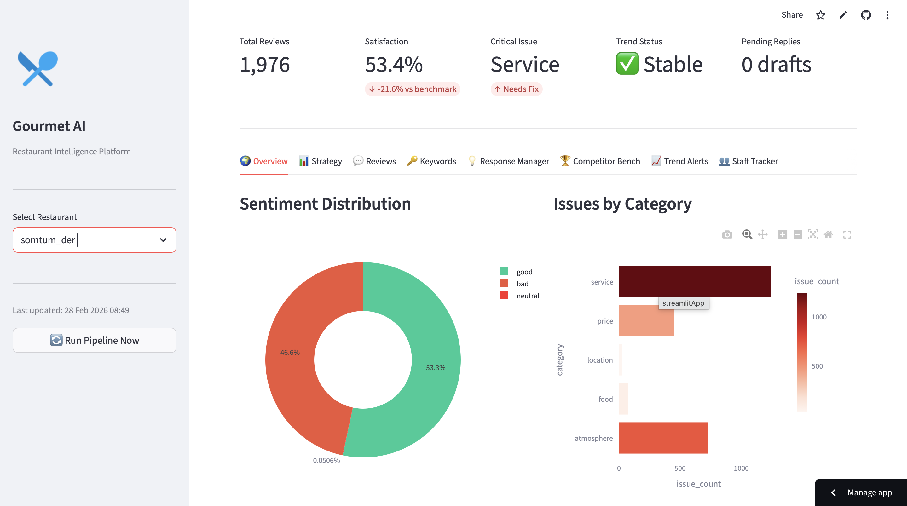
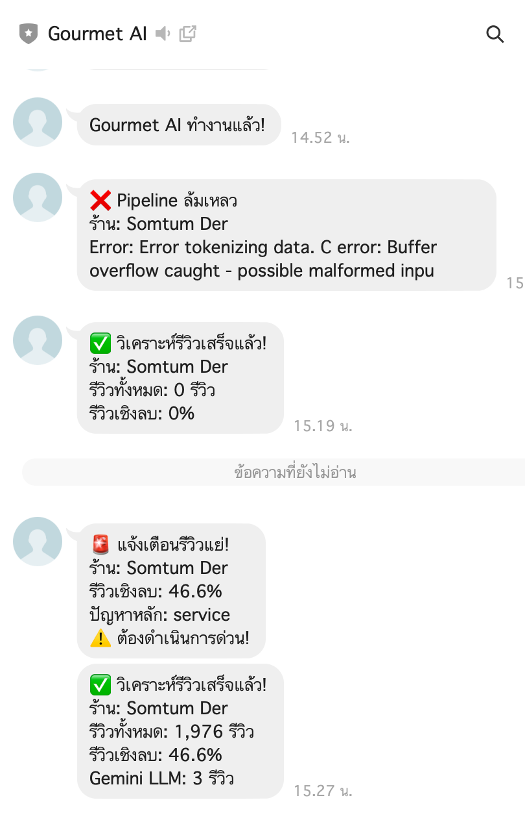

# Gourmet AI 🍽️
<p align="center">
  
</p>
<p align="center">
  
</p>

I'm an Electronics Engineering grad who somehow ended up building an AI system that reads Thai restaurant reviews. Let me explain how that happened.

## Background

I studied Electronics Engineering at KMITL Bangkok — mostly circuit design, FPGA, PCB stuff. But during an exchange program at National Taipei University of Technology in Taiwan (on a MOFA scholarship), I took an AI course that genuinely changed what I wanted to work on. After coming back, I joined 42 Bangkok, which pushed me deep into software engineering and eventually into data and AI projects.

This project came out of that combination — hardware instincts for systems thinking, AI curiosity from Taiwan, and software discipline from 42 Bangkok.

## What This Actually Does

Thai restaurants get hundreds of reviews on Wongnai. Most owners either don't read them, or read them and don't know what to do with the information. A 3-star review that says "อาหารอร่อยแต่พนักงานไม่สุภาพ" tells you two completely different things — the food is fine, the staff needs training. A simple good/bad label misses that entirely.

So I built a pipeline that:
- Pulls real reviews from Wongnai (19,458 reviews)
- Uses Gemini to actually read and understand the Thai text
- Separates what's good from what's bad, and which department owns which problem
- Calculates severity based on real complaint volume, not hardcoded rules
- Sends alerts to LINE when something needs attention
- Shows everything in a dashboard that a restaurant owner can actually use

## The Part I'm Most Proud Of

The severity calculation. Early versions just hardcoded "High" or "Low" for each category which is embarrassing in hindsight. The current version calculates it from data:

```python
# If 28% of all bad reviews mention atmosphere → that's High severity
# If only 8% mention location → that's Low severity
complaint_pct = category_count / total_bad_reviews
severity = "High" if complaint_pct > 0.25 else "Medium" if complaint_pct > 0.10 else "Low"
```

Small change, but now every number in the dashboard has a real reason behind it.

## Stack

- **Python** — pipeline, API, everything
- **Gemini 2.0 Flash** — Thai language understanding
- **Streamlit + Plotly** — dashboard
- **FastAPI** — REST API for integrations
- **n8n** — workflow automation
- **LINE Messaging API** — alerts (yes, LINE, because this is Thailand)
- **Hugging Face** — Wongnai dataset source

## How to Run

```bash
git clone https://github.com/chawaphon-duangploy/gourmet-ai.git
cd gourmet-ai

python3 -m venv venv
source venv/bin/activate
pip install -r requirements.txt

cp .env.example .env
# Add your Gemini API key to .env

python pipeline/main.py --config config/default.json
streamlit run dashboard/app.py
```

Get a free Gemini key at aistudio.google.com — the pipeline works without it using keyword fallback, but the LLM analysis is what makes it actually useful.

## Project Structure

```
pipeline/
  main.py           — runs everything in order
  extract.py        — downloads reviews
  transform.py      — cleans and balances the dataset
  analyze.py        — Gemini LLM + sentiment analysis
  responder.py      — generates Thai reply suggestions
  competitor.py     — nearby restaurant benchmarking
  trend_tracker.py  — week-over-week spike detection
  monitor.py        — watches for new reviews automatically
  notify.py         — LINE + n8n notifications

api/server.py       — FastAPI endpoints
dashboard/app.py    — 8-tab Streamlit dashboard
config/default.json — restaurant settings
```

## What I Learned

Coming from hardware, the biggest adjustment was thinking about data flow instead of signal flow. An ELT pipeline and a signal processing chain are actually not that different conceptually — you have a source, you transform it, you output something useful. The difference is the bugs are harder to see.

The LINE Messaging API took longer than it should have. Spent a while discovering that LINE Notify was shut down in March 2025, then navigating three different LINE developer portals to get the Messaging API working. It works now.

## What's Next

- Connect to live Wongnai or Google Maps reviews instead of a static dataset
- Mobile-friendly dashboard
- Multi-restaurant support for franchise owners

---

Built by Chawaphon Duangploy
Electronics Engineering, KMITL Bangkok | 42 Bangkok Cadet
